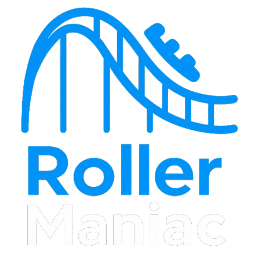
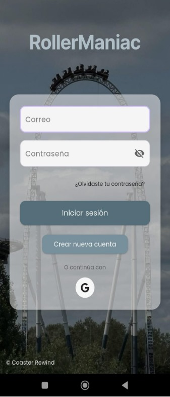
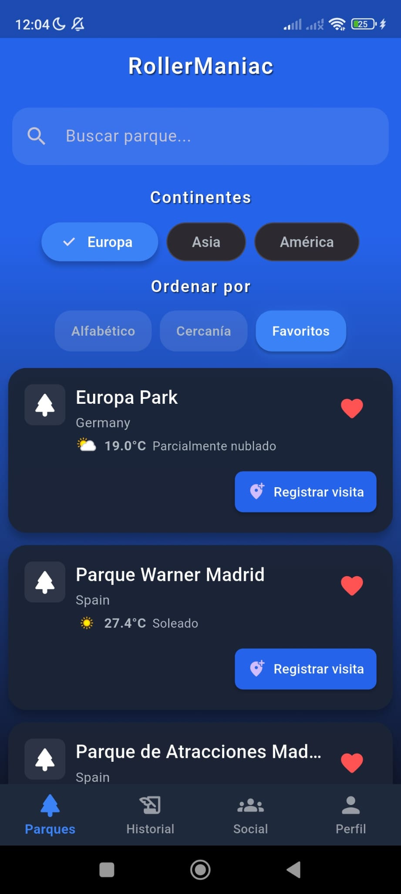
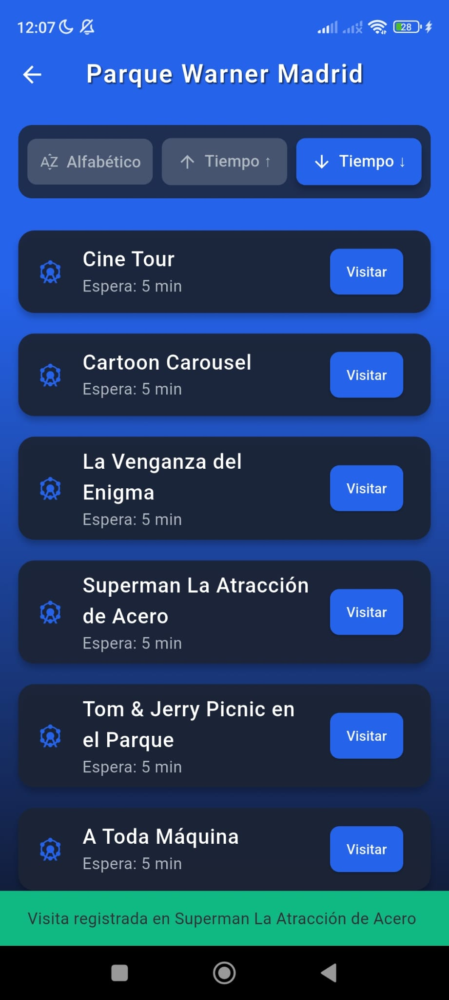
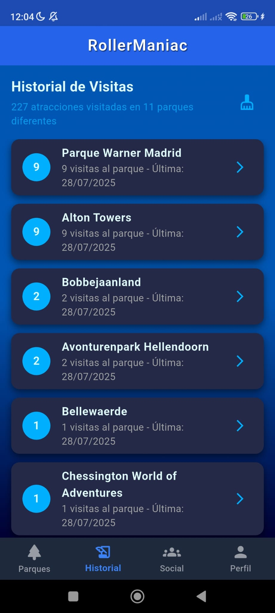

  
  

# 🎢 RollerManiac

**RollerManiac** es una app móvil multiplataforma que transforma la experiencia de los amantes de los parques de atracciones. Desarrollada con Flutter, permite consultar tiempos de espera de las atracciones en tiempo real, competir con amigos, registrar visitas y mucho más, todo en un solo lugar. El propósito de RollerManiac es centralizar en una única aplicación toda la información relevante. La aplicación nace por la necesidad en los visitantes de parques ya que, actualmente, la información sobre tiempos de espera y atracciones se encuentra dispersa en distintas apps. RollerManiac soluciona esto al integrar todas estas funcionalidades bajo una interfaz clara, visual e intuitiva.

---

## 🚀 Características principales

- ✅ **Consulta de tiempos de espera en tiempo real. Mediante la integración de la API de Queue-Times es posible consultar estos datos**
- ✅ **Historial de visitas con fecha y duración**
- ✅ **Sistema social para agregar, aceptar y gestionar amigos**
- ✅ **Ranking entre amigos por visitas**
- ✅ **Clima en tiempo real de tus parques favoritos**
- ✅ **Inicio de sesión con email y Google**  
- ✅ **Fichaje de entrada y salida de parques**  
- ✅ **Pantalla de perfil con edición y cierre de sesión**

---

## 🧠 ¿Por qué este proyecto?

**RollerManiac** nace con el propósito de unir mi pasión por los parques de atracciones con mi formación como desarrollador. Mi objetivo fue crear una aplicación funcional, realista y escalable. Este proyecto me permitió trabajar desde cero en un producto completo, cubriendo tanto el diseño técnico como la experiencia de usuario, y me enfrentó a retos reales de desarrollo. Los principales objetivos fueron:

- Diseñar una app con valor real para el usuario final, mejorando su experiencia en parques de atracciones y facilitando la interacción social entre gente con la misma afición.
- Integrar servicios reales: trabajar con Firebase (Auth, Firestore) y otras APIs, gestionando datos en tiempo real.
- Crear una comunidad de fans de parques de atracciones y montañas rusas.
- Aplicar buenas prácticas de arquitectura de software, utilizando MVVM y Clean Architecture con separación clara de capas, código modular, mantenible y preparado para testeo e inyección de dependencias.
- Desarrollar competencias profesionales: desde la planificación, la implementación modular, la validación de formularios y flujos, hasta el testing y la preparación del proyecto para producción.

Este proyecto ha sido una experiencia **realista y transversal** que demuestra mi capacidad para desarrollar, escalar y mantener una aplicación profesional de principio a fin, trabajando con tecnologías actuales.

---

## 🖼️ Capturas de pantalla

A continuación puedes ver algunas pantallas de RollerManiac en funcionamiento. Aunque todavía estoy puliendo ciertos detalles de la interfaz (como algunos iconos o la navegación inferior), ya se puede apreciar la estructura general y la funcionalidad principal de la app.

Incluyo aquí capturas de pantalla de:

- Pantalla de inicio de sesión  
- Vista principal con parques disponibles  
- Consulta de tiempos de espera en atracciones  
- Historial de visitas del usuario

  
  
  
  

### ℹ️ Nota sobre los datos de prueba

*Los datos mostrados en las capturas son ficticios y fueron generados exclusivamente para testear las distintas funcionalidades de la app. Por ello, puede aparecer más de un parque visitado en el mismo día u otros patrones poco realistas. En producción, los datos reflejarán la actividad real del usuario.*

## 🛠️ Tecnologías y herramientas

- **Flutter + Dart**
- **Firebase Auth & Firestore**
- **Clean Architecture + MVVM**
- **Provider para gestión de estado**
- **SharedPreferences**
- **OpenWeatherMap API (clima en tiempo real)**
- **Queue-Times API (tiempos de espera en atracciones)**
- **Metodología Scrum**

---

## 🧱 Arquitectura y buenas prácticas

El proyecto está estructurado siguiendo Clean Architecture y el patrón MVVM:

Cada **feature** se divide en:

- data/ → data sources, modelos DTO  
- domain/ → entidades, repositorios  
- presentation/ → widgets, pantallas, ViewModels  

✅ Separación clara de responsabilidades  
✅ Fácil de testear y escalar  
✅ Preparado para inyección de dependencias (si se desea)  

## 🧪 Fase de pruebas y validación real
- Validación funcional y de usabilidad realizada con 10 usuarios reales, todos aficionados a parques, quienes confirmaron la utilidad y funcionalidad de la app en escenarios reales.
- Actualmente en proceso de implementación de pruebas automatizadas unitarias y de integración para garantizar calidad y estabilidad en el código.

Este proyecto ha sido desarrollado **100% por mí**, desde la planificación, el diseño de interfaz y la arquitectura, hasta la implementación y la validación final. Ha supuesto un desafío completo que refleja no solo mis habilidades técnicas, sino también mi compromiso con la calidad, la autonomía y la mejora continua.

## 📌 Retos técnicos superados
 - Configuración avanzada de inicio de sesión con Google y claves SHA-1/SHA-256
 - Tratamiento de JSONs inconsistentes en Queue-Times con lógica adaptativa
 - Implementación modular y desacoplada con arquitectura robusta
 - Gestión eficiente del estado con Provider y reconstrucciones controladas

## 🔭 Futuras mejoras
RollerManiac está en una fase avanzada, pero diseñada para escalar. Algunas líneas de evolución previstas:

- Sistema de logros y medallas por visitas
- Ranking global entre todos los usuarios registrados
- Estadísticas visuales y panel de usuario con gráficos sobre visitas mensuales/anuales
- Integración de mapas interactivos con ubicaciones de atracciones
- Datos técnicos de montañas rusas (altura, velocidad, fuerzas Gs...)

## 👤 Sobre mí

Soy Sergio López, desarrollador de software titulado en el Ciclo Formativo de Grado Superior en Desarrollo de Aplicaciones Multiplataforma (DAM). A lo largo de mi formación he trabajado con tecnologías como Java, Python, SQL, PL/SQL, Kotlin, .NET y bases de datos tanto relacionales como NoSQL.

Además de RollerManiac, he desarrollado una aplicación real para el Colegio Internacional Kolbe, utilizada por el personal para registrar fichajes de entrada/salida y visualizar gráficos de horas trabajadas. Esto me ha permitido aplicar mis conocimientos en proyectos reales, con requisitos funcionales concretos y lógica empresarial.

Este proyecto representa para mí un importante paso tanto a nivel profesional como personal. Profesionalmente, me ha permitido consolidar habilidades clave en desarrollo móvil y gestión de bases de datos, así como la integración de arquitecturas limpias y buenas prácticas de programación. A nivel personal, ha supuesto un desafío que me ha impulsado a mejorar mi capacidad de planificación, resolución de problemas y atención al detalle, fortaleciendo mi compromiso con la calidad y la innovación en el desarrollo de software.

## 📫 Contacto

Si quieres conocer más sobre mi forma de trabajar, colaborar en algún proyecto o estás interesado en conectar conmigo, no dudes en contactarme:

💼 [LinkedIn](https://www.linkedin.com/in/sergio-lopez-dev/)
📧 slopezmar3@gmail.com

## 🧩 Licencia
- Este proyecto es personal y académico. Puedes consultarlo, usar partes para aprendizaje, pero no está licenciado para uso comercial directo sin permiso.
---

